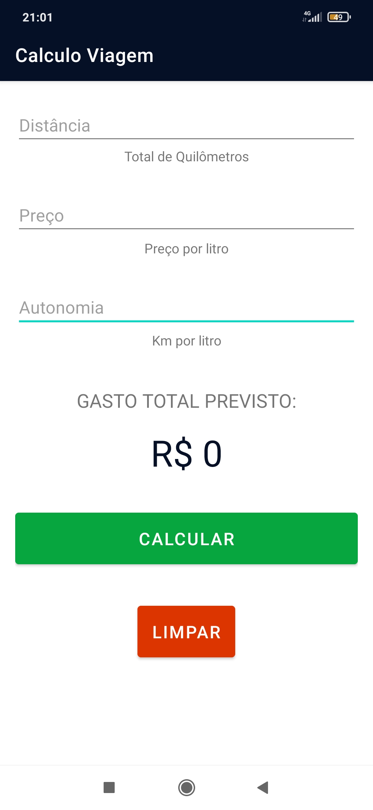
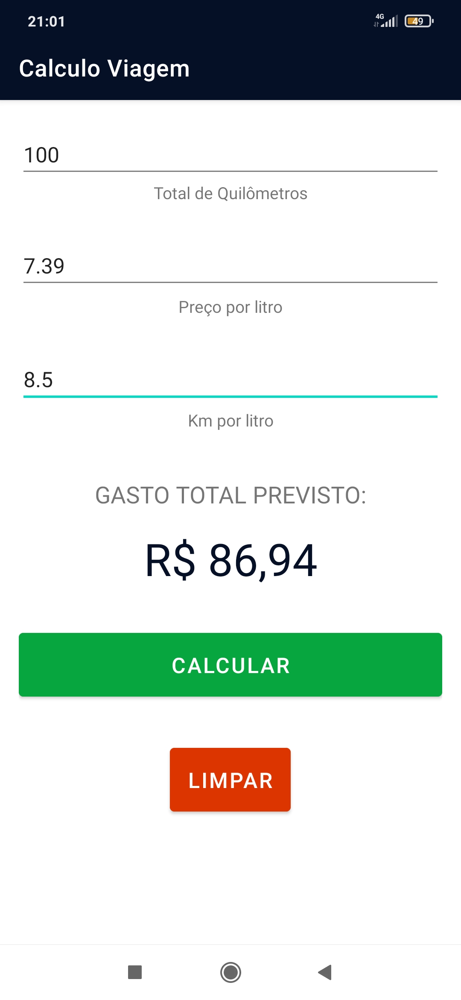

# Calculadora_de_Viagens
Trabalho desenvolvido para demostrar conhecimentos adquiridos na primeria e segunda etapas do bloco de interface em Android

  

  

  

## Descrição
A aplicação calcula os dados preenchidos pelo usuário e retorna o valor em R$ do gasto previsto com a viagem em combústiveis.
